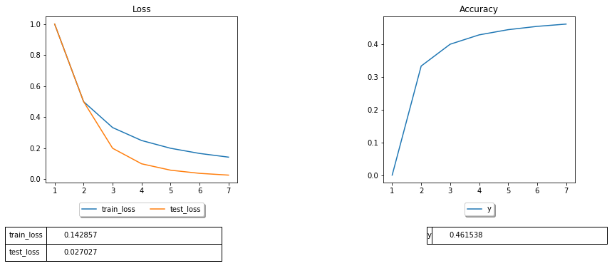
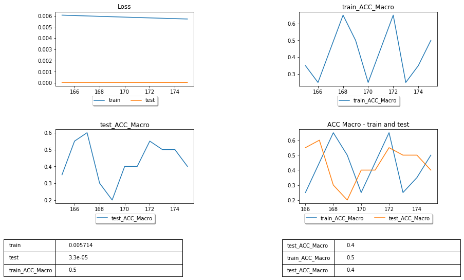

# Traintorch (alpha)


Package for live visualization of model validation metrics during training of a machine learning model in jupyter notebooks.
 

## Requirements:

```
pandas==0.25.1
matplotlib==3.1.1
ipython==7.8.0
numpy==1.17.2
pycm==2.2
```
 ## Installation:
 ```
 pip install traintorch
  ```
or

 ```
 pip install git+https://github.com/rouzbeh-afrasiabi/traintorch.git
 ```

## Example 

```python

from traintorch import *

#custom metric
first=metric('Loss',w_size=10,average=False)

#create an instance of traintorch
tracker=traintorch(n_custom_plots=1,main_grid_hspace=.1, figsize=(15,10),show_table=True)
#combine all metrics together
tracker.concat_metrtics([first])


range_max=1000
for i in range(0,range_max,1):
    
    first.update(train=1/(i+1),test=1/(i**2+1))
    tracker.create()
```
 <p align='center'>
 </img>
 
 </p>


```python
from traintorch import *


#custom metric
first=metric('Loss',w_size=10,average=False)

#pycm metrics
overall_selected=['ACC Macro']
cm_metrics_a=pycmMetrics(overall_selected,name='train',w_size=10)
cm_metrics_b=pycmMetrics(overall_selected,name='test',w_size=10)

#compare two metrics of the same kind
compare_a=collate(cm_metrics_a,cm_metrics_b,'ACC Macro')

#create an instance of traintorch
tracker=traintorch(n_custom_plots=1,main_grid_hspace=.1,figsize=(15,15),show_table=True)

#combine all metrics together
tracker.concat_metrtics([first,cm_metrics_a,cm_metrics_b,compare_a])


range_max=1000
for i in range(0,range_max,1):
    
    actual_a=np.random.choice([0, 1], size=(20,), p=[1./3, 2./3])
    predicted_a=np.random.choice([0, 1], size=(20,),p=[1-(i/range_max), i/range_max])
    actual_b=np.random.choice([0, 1], size=(20,), p=[1./3, 2./3])
    predicted_b=np.random.choice([0, 1], size=(20,),p=[1-(i/range_max), i/range_max])
    cm_metrics_a.update(actual_a,predicted_a)
    cm_metrics_b.update(actual_b,predicted_b)
    first.update(train=1/(i+1),test=1/(i**2+1))
    compare_a.update()
    tracker.create()

```
 <p align='center'>
 </img>
 
 </p>
