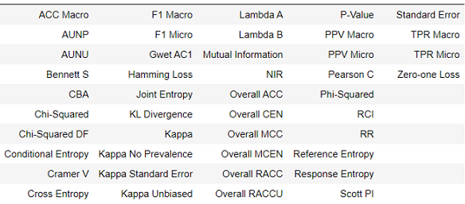

# TrainTorch v.1.0.2-alpha
[](https://www.codacy.com/manual/rouzbeh-afrasiabi/traintorch?utm_source=github.com&amp;utm_medium=referral&amp;utm_content=rouzbeh-afrasiabi/traintorch&amp;utm_campaign=Badge_Grade)


<p align="justify">
Package for live visualization of model validation metrics during training of a machine learning model in jupyter notebooks. Traintorch utilizes a sliding window mechanism to reduce memory usage.
</p> 

## Requirements:

```
pandas==0.25.1
matplotlib==3.1.1
pycm==2.2
```
 ## Installation:
 
 ### Latest release:
 ```
 pip install traintorch
  ```
  
### Latest Version

 ```
 pip install git+https://github.com/rouzbeh-afrasiabi/traintorch.git
 ```
### Metrics available through pycm
<p align='center'>
  </img>
</p>

```
ACC Macro, AUNP, AUNU, Bennett S, CBA, Chi-Squared,Chi-Squared DF, Conditional Entropy, Cramer V,Cross Entropy, F1 Macro, F1 Micro, Gwet AC1,Hamming Loss, Joint Entropy, KL Divergence, Kappa,Kappa No Prevalence, Kappa Standard Error, Kappa Unbiased,Lambda A, Lambda B, Mutual Information, NIR, Overall ACC,Overall CEN, Overall MCC, Overall MCEN, Overall RACC,Overall RACCU, P-Value, PPV Macro, PPV Micro, Pearson C, Phi-Squared, RCI, RR, Reference Entropy,Response Entropy, Scott PI, Standard Error, TPR Macro,TPR Micro, Zero-one Loss
```
<p align="justify">
Following class metrics are also available through pycm but their use is currently not recommended.
</p> 

```
TPR, TNR, PPV, NPV, FNR, FPR, FDR, FOR,ACC, F1, MCC, BM, MK, PLR, NLR, DOR, TP, TN, FP,FN, POP, P, N, TOP, TON, PRE, G, RACC, F0.5, F2,ERR, RACCU, J, IS, CEN, MCEN, AUC, sInd, dInd, DP,Y, PLRI, DPI, AUCI, GI, LS, AM, BCD, OP, IBA, GM,Q, AGM, NLRI, MCCI
```
For more information about these metrics please see: <a href="https://github.com/sepandhaghighi/pycm">pycm</a>
## Example 

### Simple Usage
```python
from traintorch import *

#custom metrics
first=metric('Loss',w_size=10,average=False)
second=metric('Accuracy',w_size=10,average=False)


#create an instance of traintorch
tracker=traintorch(n_custom_plots=2,main_grid_hspace=.1, figsize=(15,10),show_table=True)
#combine all metrics together
tracker.append([first,second])


range_max=1000
for i in range(0,range_max,1):
    
    first.update(train_loss=1/(i+1),test_loss=1/(i**2+1))
    second.update(y=i/(i*2+1))
    tracker.plot()
```
 <p align='center'>
 </img>
 
 </p>


### Using pycm metrics and doing comparison


```python
from traintorch import *


#custom metric
first=metric('Loss',w_size=10,average=False)

#pycm metrics
overall_selected=['ACC Macro']
cm_metrics_a=pycmMetrics(overall_selected,name='train',w_size=10)
cm_metrics_b=pycmMetrics(overall_selected,name='test',w_size=10)

#compare two metrics of the same kind
compare_a=collate(cm_metrics_a,cm_metrics_b,'ACC Macro')

#create an instance of traintorch
tracker=traintorch(n_custom_plots=1,main_grid_hspace=.1,figsize=(15,15),show_table=True)

#combine all metrics together
tracker.append([first,cm_metrics_a,cm_metrics_b,compare_a])


range_max=1000
for i in range(0,range_max,1):
    
    actual_a=np.random.choice([0, 1], size=(20,), p=[1./3, 2./3])
    predicted_a=np.random.choice([0, 1], size=(20,),p=[1-(i/range_max), i/range_max])
    actual_b=np.random.choice([0, 1], size=(20,), p=[1./3, 2./3])
    predicted_b=np.random.choice([0, 1], size=(20,),p=[1-(i/range_max), i/range_max])
    cm_metrics_a.update(actual_a,predicted_a)
    cm_metrics_b.update(actual_b,predicted_b)
    first.update(train=1/(i+1),test=1/(i**2+1))
    compare_a.update()
    tracker.plot()

```
 <p align='center'>
 </img>
 </p>
